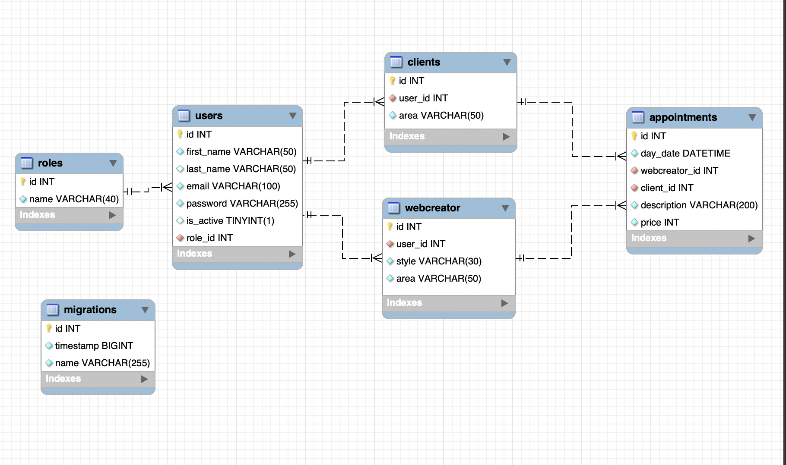

# WeCareApp- Backend

<details>
  <summary>Content</summary>
  <ol>
    <li><a href="#stack">Stack</a></li>
    <li><a href="#objective">Objective</a></li>
    <li><a href="#about-the-project">About the project -🔎</a></li>
    <li><a href="#installation">Installation</a></li>
    <li><a href="#webgrafia">Webgrafia</a></li>
    <li><a href="#licence">Licence</a></li>
    <li><a href="#contact">Contact</a></li>

  </ol>

</details>

## Stack

Used technologies:  
Principal language typescript, 🛠️ TypeORM. API REST, Docker/images Mysql & Async/Await functionalities.

<div align="center">

<a href="https://nodejs.org/en">
    
</a>

<a href="https://nextjs.org/">
    
</a>

</div>

## Objective

Create an Appointment Management System for an NGO dedicated to build and maintain specific web pages.

## About the project -🔎

The customer must be able to register in the application, log in and access their customer area, all visually from the browser.

Appointments: modify and cancel them. Client will be able to create appointments with webcreators. There will also be a user area with his personal data, which only he will be able to see.

Create / Register/ Edit Profile Login/ Logout.

SuperAdmin will be able to edit or delete profiles as well as appointments.
● User will be able to view product catalogue (the type of website he/she will need) and
select the one he/she likes.

## DB Diagram



# Main Endpoints

- REGISTER

        POST  `/api/auth/register`

  body:

  ```js
     {
      "firstName":"Cristiano",
      "lastName":"Ronaldo",
      "email":"cronaldino@gmailcom",
       }
  ```

- LOGIN - AUTH

        POST  `/api/auth/login`

  body:

  ```js
      {
          "id":41
       "firstName":"Cristiano"
       "lastName":"Ronaldo"
       "email":"cronaldino@gmail.com"
       "password":99998888
      }
  ```

- DETALLES DEL PERFIL- RUTA

         GET  `/api/users/profile`

- DETALLES DEL PERFIL POR ID

        GET `/api/users/25`

## Local Installation

Follow these steps to install and run the project locally:

1.  Clone this repository: `git clone`
2.  Install the dependencies: `npm install`
3.  Run the application: `npm start`
4.  Install extra dependencies & additional modules: `package json` `gitgnore`
    `node modules`
    `npm i cors`
    `npm i -D @types/cors`
    `npm i -D nodemon`
    `npm i -D ts-node`
    `npm i bcrypt`
    `npm i -D @types/bcrypt`
    `npm i @faker-js/faker`
    `npm i jsonwebtoken`
    `npm i -D @types/jsonwebtoken`
    `npm i dotenv`
    `npm i typeorm reflect-metadata mysql2`
5.  We connect our repository to the database - in my case I have used Docker Mysql images.

6.  We run the migrations through the Factories, Models (Entity) files to populate the database through the Seeders. Then start defining the routes per resource by means of the path files (the CRUD).

7.  We run the server `npm run dev`
8.  We start user authentication by means of a token. `JWT` string coded. This token contains all the encoded information and will be generated via the API with all the data and extra internal information.

9.  Finally we configure the middleware Authorizations & ErrorHandlers 🎉 There you have 🎁 an API ready to serve data!!

## Webgrafia:

To develop this project you can review the following info below:

<a href="https://typeorm.io/" target="_blank"> Documentación TypeORM</a>

<a href="https://jwt.io/" target="_blank"> Documentación Json Web Token</a>

<a href="https://fakerjs.dev/" target="_blank"> Faker Data Generator </a>

## Future Improvements

🤔

## Contact 👩🏽‍💻

<a href="https://www.linkedin.com/in/marissarico" target="_blank"> </a>

---
